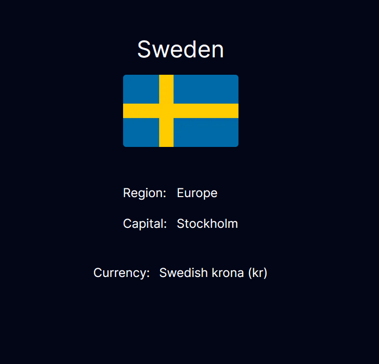

## Country API

This is an app where you can search countries and see information about their flag, capital city and currency.

### Techniques used

The app uses a restfulAPI from restcountries.com and is built with Next.js, TypeScript and TailwindCSS

## See projekt
https://carinwood-country-api.vercel.app/

